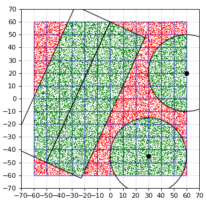
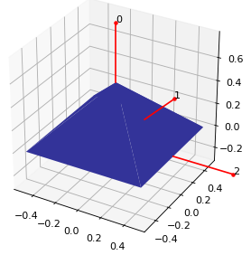
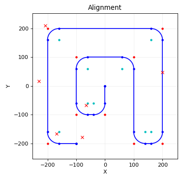
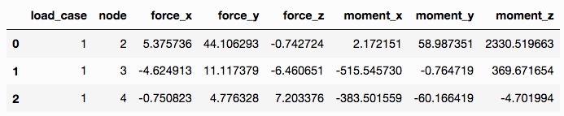
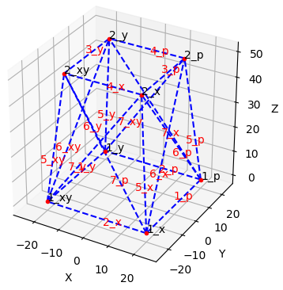
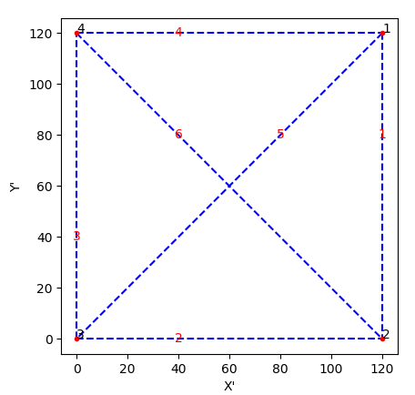

# CivPy

[](https://travis-ci.com/mpewsey/civpy)
[](https://civpy.readthedocs.io/en/latest/?badge=latest)
[](https://codecov.io/gh/mpewsey/civpy)

## About

This package provides civil engineering tools and algorithms for creating
survey and structure models in Python.

## Installation

The development version of this package may be installed via pip:

```none
pip install git+https://github.com/mpewsey/civpy#egg=civpy
```

## Features

### Survey Tools

<table style='text-align: center'>
    <tr>
        <td width='50%' align='center'>
            <br>
            Find points in N-dimensional spaces using spatial hash distance queries.
        </td>
        <td width='50%' align='center'>
            <br>
            Create ground surface triangulations, find surface elevations, and
            perform point distance queries to the surface.
        </td>
    </tr>
    <tr>
        <td width='50%' align='center'>
            <br>
            Model survey alignments with or without horizontal curves and perform coordinate calculations.
        </td>
        <td width='50%' align='center'>
        </td>
    </tr>
</table>

### Structure Modeling

<table style='text-align: center'>
	<tr>
	  <td colspan='2' align='center'>
	  <br>
     Perform analysis of 2D and 3D trusses and manipulate node, element, and reaction results using Pandas data frames.
     </td>
	</tr>
    <tr>
        <td width='50%' align='center'>
            <br>
            Model structures with symmetry.
        </td>
        <td width='50%' align='center'>
            <br>
            Plot structure geometry in 3D or in 2D cross sections.
        </td>
    </tr>
</table>
